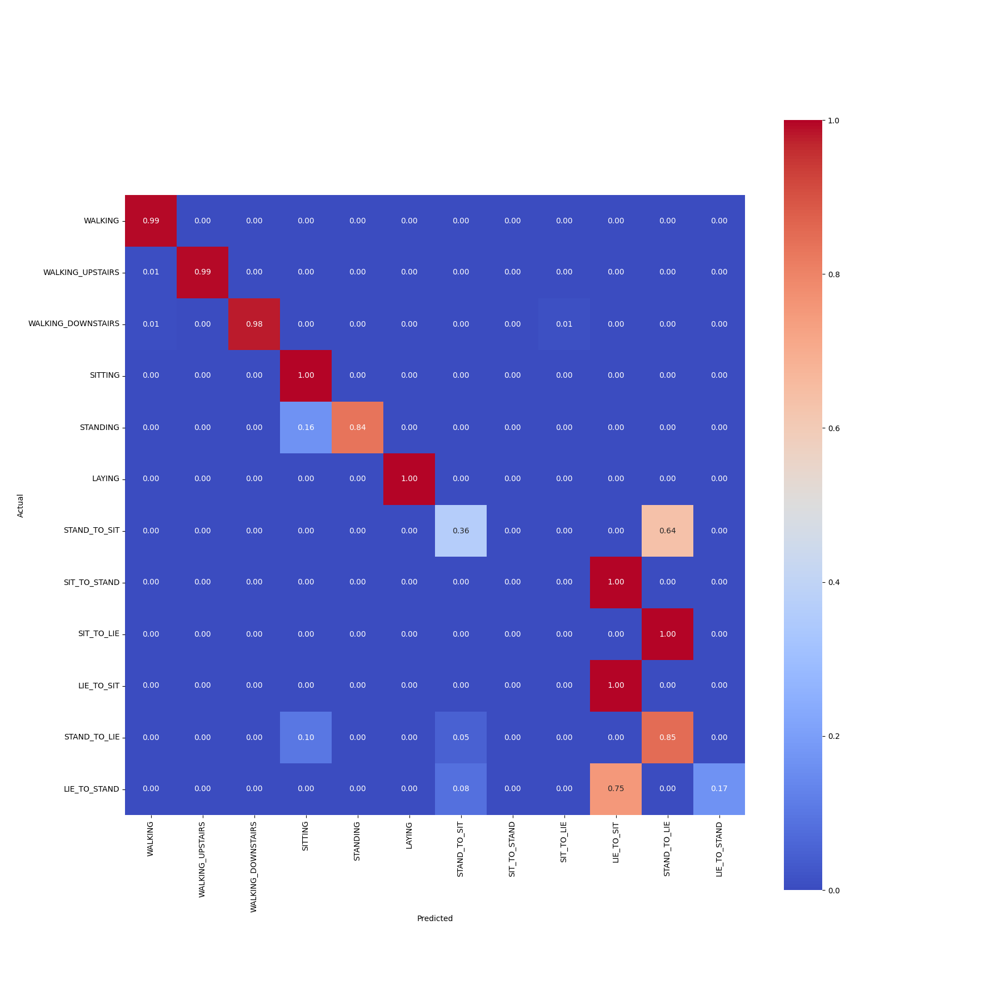

# Human-Activity-Recognition
# How to run the code

**Human Activity Recognition**  
For Training : ```python main.py --train=True model_type model_name```
model_type can be 'seq2seq', 'seq2label'
model_name can be 'GRU_Model', 'LSTM_model', 'ConvLSTM'

For Training : ```python main.py --train=True model_type model_name checkpoint_folder_path```
model_type can be 'seq2seq', 'seq2label'
model_name can be 'GRU_Model', 'LSTM_model', 'ConvLSTM'

**Human Activity Recognition**

Our approach involves preprocessing raw sensor data, applying Z-score normalization, and structuring the input using a sliding window technique for both sequence-to-label and sequence-to-sequence learning tasks. We implement and compare multiple deep learning architectures, including Long Short-Term Memory (LSTM), Gated Recurrent Unit (GRU), and CNN-LSTM models, to predict human activities effectively. The models are trained and evaluated based on accuracy, confusion matrices, and weighted F1 scores, accounting for class imbalances.

| **Model**    | **Accuracy**| **F1 Score (weighted)** |
|--------------|--------------|------------------------|
| Simple LSTM  | 90.78        |     0.90               |
| GRU          | 94.87        |     0.94               |
| ConvLSTM     | 88.71        |     0.88               |

  
**Figure 3:** Confusion matrix for the GRU model.  
